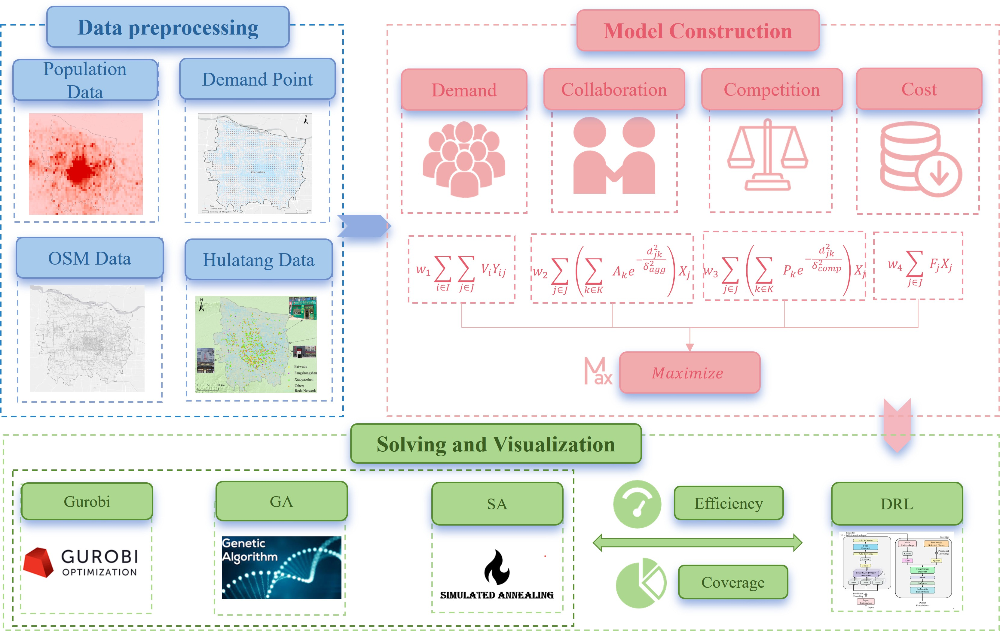
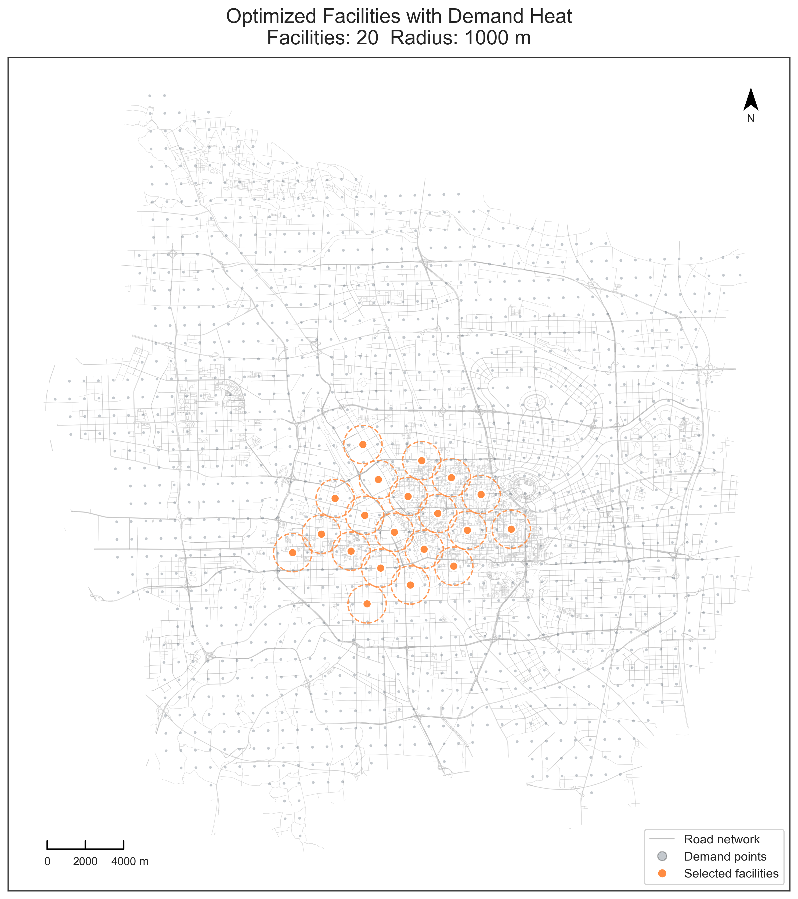
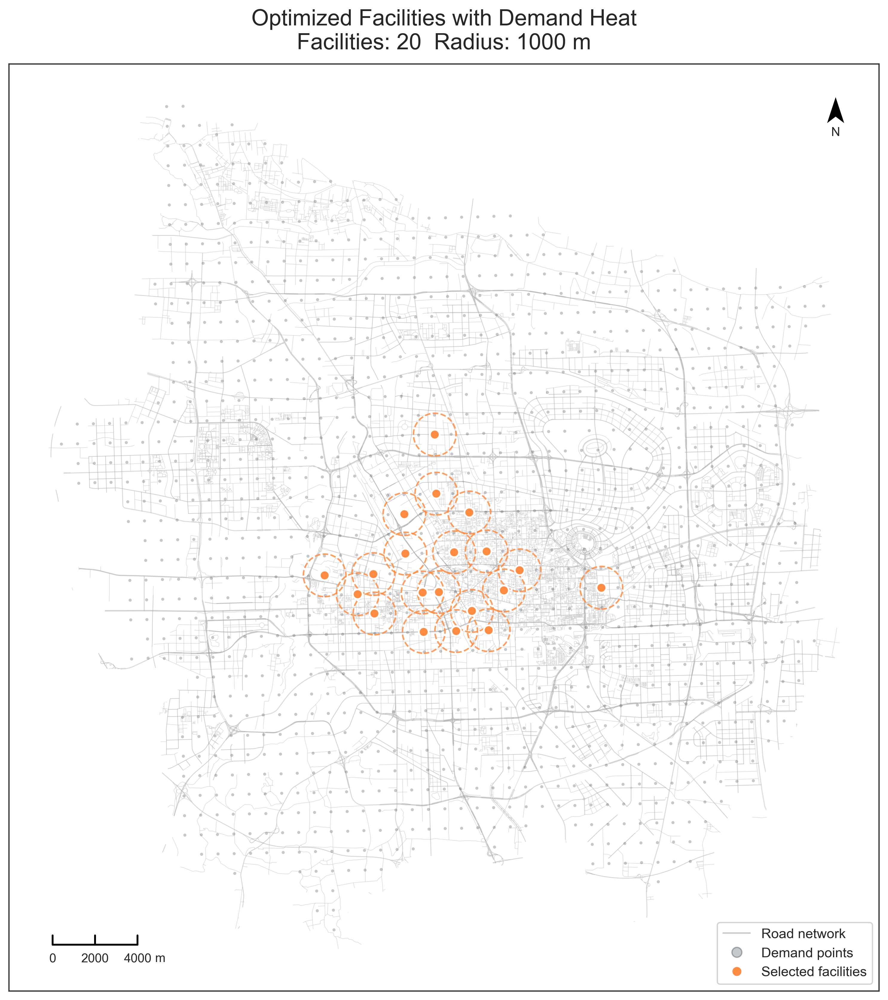
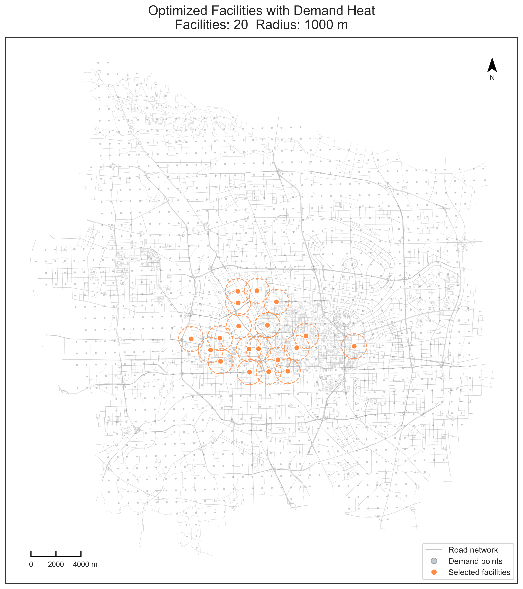
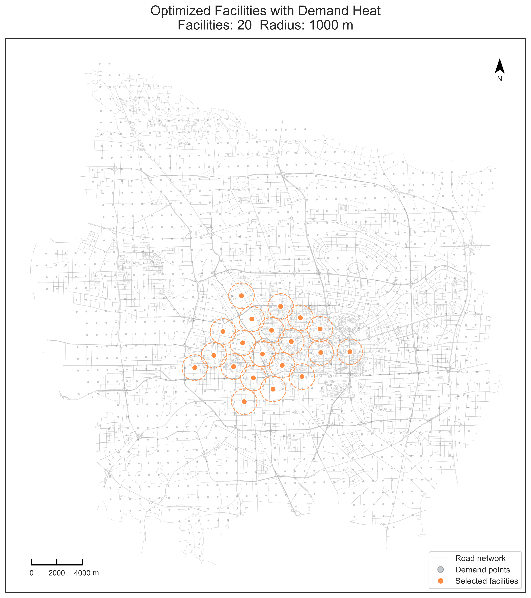

# Hulatang-Location-Optimization
## Cooperative-Competitive Hulatang Location Optimization Based on Deep Reinforcement Learning: A Case Study of Zhengzhou

This repository implements a cooperative–competitive location model for Hulatang shops and provides four families of solvers with visualization:
- Gurobi (integer programming with service-radius filtering)
- GA (Genetic Algorithm)
- SA (Simulated Annealing; demonstrated in notebooks)
- DRL (Attention-based deep reinforcement learning, PyTorch)

The overall pipeline of data preprocessing, model construction, and visualization is shown below (`image/image1.jpg`):



Selected visualization results (see more in the `image/` folder):

<div align="center">


<br/>


</div>

---

### 1. Environment & Dependencies

- Python == 3.7
- CUDA is optional (match your PyTorch build if used)

Required packages:

```bash
# Use a virtual environment if possible
conda install pytorch==1.11.0 torchvision==0.12.0 torchaudio==0.11.0 cudatoolkit=11.3 -c pytorch
pip install scipy tqdm matplotlib pandas geopandas
pip install git+https://github.com/TeamHG-Memex/tensorboard_logger
```

Optional / method-specific:

- Gurobi: `pip install gurobipy` and configure a valid license per the official guide
- For prettier maps, keep `geopandas` working with `fiona` and `gdal`

> On Windows/conda, if `geopandas` is hard to install: `conda install -c conda-forge geopandas`.

---

### 2. Data Preparation

Place raw data under `data/HuLaTang/`:

```
data/HuLaTang/
  ├─ Demand_Point.shp  # demand points (Point features; contains All_pop)
  ├─ Candidate_Point.csv                    # candidate shops with coordinates and rent 
  └─ Hulatang.csv                 # existing shops with coordinates (X/Y or POINT_X/POINT_Y), Ak, Pk
```

Optional road basemap:

- `data/HuLaTang/Road_Network.shp` (notebooks will try to load it automatically)

---

### 3. Quick Start (by method)

#### 3.1 Gurobi (Mathematical Programming)

The full workflow is provided in `HulaTang_Gurobi.ipynb`:

1) Launch Jupyter and open the notebook:

```bash
jupyter notebook HulaTang_Gurobi.ipynb
```

2) Execute cells in order to:
- Read and normalize data (unified normalization for candidates and existing shops)
- Build allowed service pairs `allowed_pairs` from a service radius
- Formulate and solve the model; print selected indices and metrics
- Plot publication-ready figures (saved to the project root)

> If you only want the figure, check `image/hulatang_result_pretty_Gurobi.png` directly.

#### 3.2 GA (Genetic Algorithm)

See `Hulatang_GA.ipynb`:

```bash
jupyter notebook Hulatang_GA.ipynb
```

The notebook loads `shp/csv`, applies unified normalization, computes B/C/rents, calls `Algorithm/GA_Hulatang.py::GeneticAlgorithm`, and plots/saves results.

> You may tune `p`, radius, weights `w1..w4`, and evolutionary parameters in the notebook.

#### 3.3 SA (Simulated Annealing)

SA demonstrations and exports are also provided in a notebook (similar data prep and plotting). A sample figure is `image/hulatang_result_pretty_SA.png`.

#### 3.4 DRL (Deep Reinforcement Learning)

```bash
# Training (example; adjust as needed)
python run.py 
```


### 4. Results & Visualization

- Example outputs for the four methods are available in `image/`:
  - `hultatang_result_pretty_Gurobi.png`
  - `hultatang_result_pretty_GA.png`
  - `hultatang_result_pretty_SA.png`
  - `hultatang_result_pretty_DRL.png`
- Notebooks include advanced plotting utilities (road overlay, hexbin demand heat, service circles, etc.).

---

<!-- ### 5. Citation

If you find this repository useful, please cite:

```
@article{hulatang_drl_ccmclp,
  title   = {Cooperative-Competitive Hulatang Location Optimization Based on Deep Reinforcement Learning: A Case Study of Zhengzhou},
  author  = {Anonymous},
  year    = {2025},
  note    = {GitHub repository: HUlatang},
}
``` -->

---

### 5. License & Acknowledgements

- Source code is for academic research and teaching only. Data copyrights remain with the original providers.
- Acknowledgements: [SpoNet](https://github.com/HIGISX/SpoNet), PyTorch, SciPy, tqdm, tensorboard_logger, Matplotlib, GeoPandas, and Gurobi.

